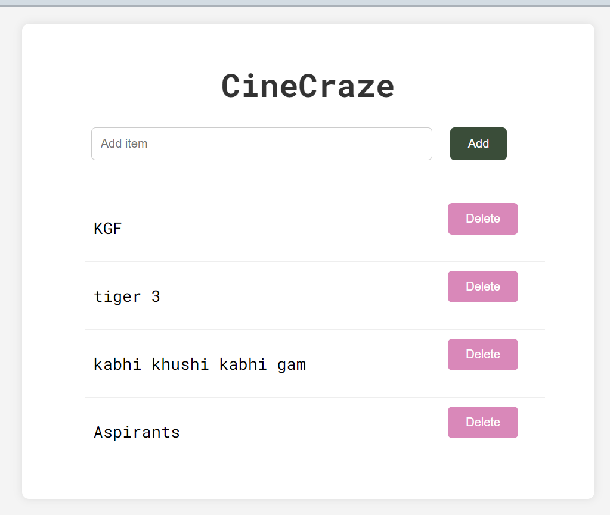

# CineCraze

Welcome to CineCraze - Your Personal Watchlist App!

## Overview

CineCraze is a sleek and user-friendly application that allows you to manage your movie and drama watchlist effortlessly.

## Features

- **Add Movies and Dramas**: Easily add, and delete movies and dramas to your watchlist.
- **Intuitive Interface**: Simple and intuitive design for smooth navigation and usage.

## Tech Stack

This project is built using the following technologies:

- HTML
- CSS
- Node.js
- MySQL

## Screenshots

<!-- Replace 'link_to_screenshot.png' with the actual path or URL to the screenshot -->

## Demo Video

<video width="320" height="240" controls>
  <source src="./Image/demo.mp4" type="video/mp4">
  <source src="movie.ogg" type="video/ogg">
  Your browser does not support the video tag.
</video>

## Logo

<!-- Replace 'link_to_logo.png' with the actual path or URL to the logo -->

Feel free to explore and enhance the app as per your preferences!

### Support

For any queries or support, reach out to [agrawalricha013@gmail.com].

Enjoy organizing your watchlist with CineCraze!
